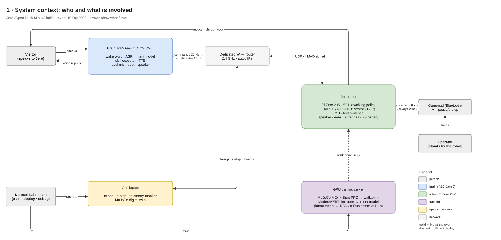
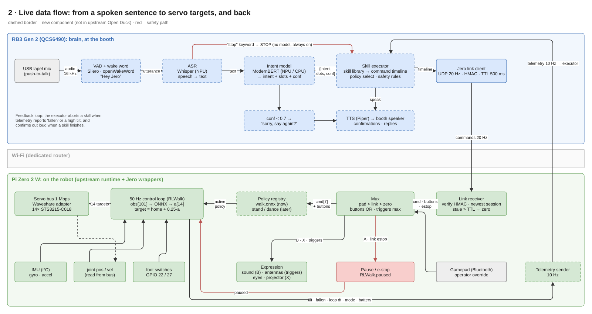
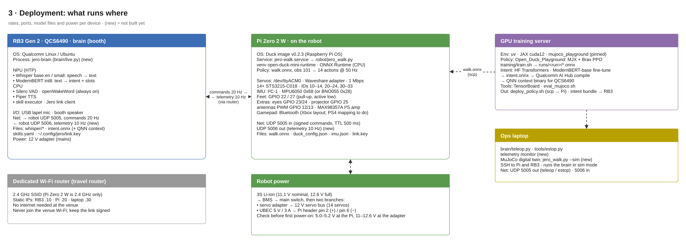
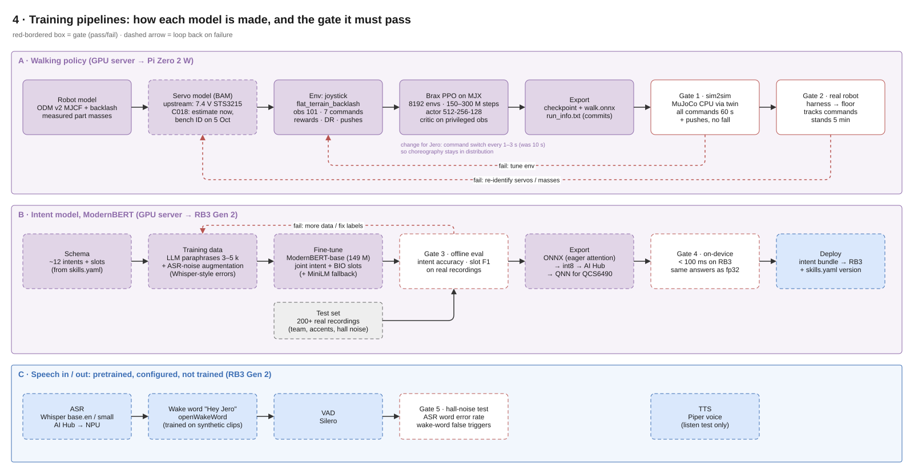
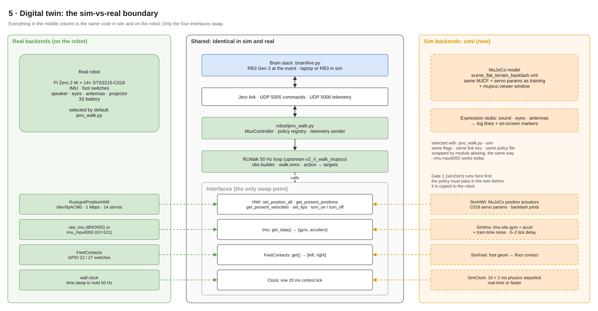
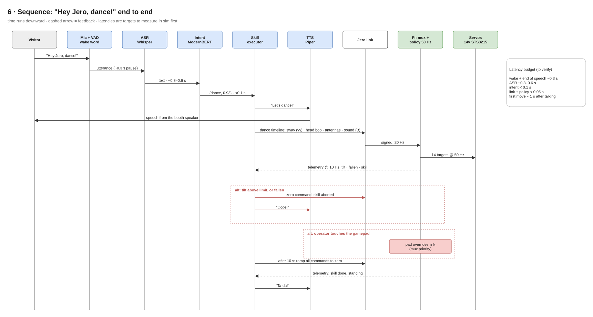
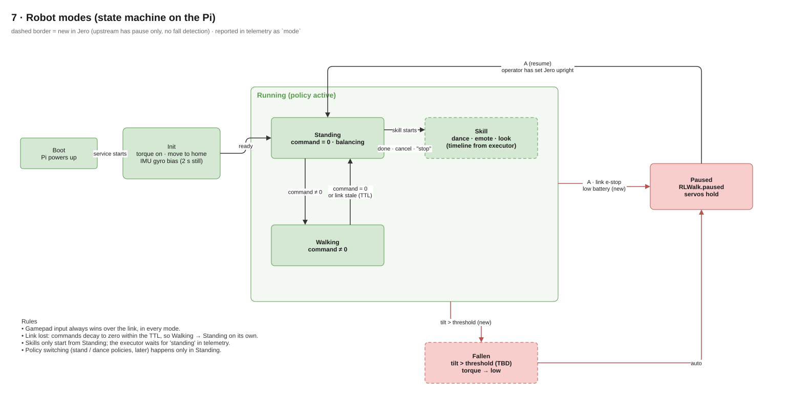

# Jero architecture

Seven diagrams, one question each. Build order: **simulation first**. The MuJoCo digital twin runs the full stack (voice → intent → skills → link → policy) before any hardware is involved.

## Editing the diagrams

- **One file, all pages:** [`Jero-architecture.drawio`](Jero-architecture.drawio). Open it in draw.io (app.diagrams.net, desktop app or the VS Code extension) and save it to Google Drive if you work from there. Or use *File → Import* to add its pages to an existing Drive diagram.
- **One page per file:** `N-*.drawio.svg`. Each of these is a picture (it renders on GitHub and in this README) and an editable diagram at the same time: open it in draw.io, edit, save. Keep the `.drawio.svg` extension.
- If you edit a page in one place, copy it to the other: either re-export that page from the combined file as `.drawio.svg`, or import the `.svg` back into the combined file.
- Colours: blue = RB3 Gen 2 brain · green = robot (Pi Zero 2 W) · purple = training · orange = simulation · yellow = ops laptop · red = safety / gates.
- Dashed border = component that doesn't exist yet.

## 1 · System context: who and what is involved



The visitor talks to the brain (RB3 Gen 2). The robot is driven over a dedicated Wi-Fi router. The operator's gamepad pairs to the robot directly and always overrides the brain. Training happens offline on the GPU server.

## 2 · Live data flow: one sentence to servo targets, and back



Two loops:

- **Commands:** speech → text → intent → skill timeline → 20 Hz commands → mux → 50 Hz policy → servos.
- **Feedback:** telemetry at 10 Hz → executor, which aborts a skill on a fall and confirms out loud when it finishes.

The `"stop"` keyword skips the intent model entirely.

## 3 · Deployment: what runs where



## 4 · Training pipelines and gates



| Gate | Pass criterion |
|---|---|
| 1 · sim2sim | New `walk.onnx` walks every command for 60 s with pushes in the MuJoCo twin (CPU, real runtime code path), no fall |
| 2 · real | Hanging in a harness, then on the floor: tracks commands, stands 5 min |
| 3 · intent offline | Intent accuracy and slot F1 on **real team recordings**, not just synthetic data (targets to set after the first run) |
| 4 · intent on-device | < 100 ms on the RB3 Gen 2; int8 model gives the same answers as fp32 on the test set |
| 5 · speech | Word error rate and wake-word false triggers measured with hall-noise playback |

## 5 · Digital twin: the sim-vs-real boundary



`jero_walk.py --sim` swaps four interfaces (HWI, Imu, FeetContacts, clock) for MuJoCo-backed versions, using the same module-aliasing trick as `--imu mpu6050`. Nothing above those interfaces changes, so the brain can't tell sim from real.

## 6 · Sequence: "Hey Jero, dance!"



## 7 · Robot modes



## Interfaces (contracts between parts)

### Command: brain → robot, UDP 5005 (exists: `jero_link`)

`vx, vy, wz, neck_pitch, head_pitch, head_yaw, head_roll` + `buttons` (A B X Y LB RB dpad_up dpad_down) + `left_trigger, right_trigger` + `estop` + `ttl_ms` (50–2000). Signed with HMAC-SHA256. The receiver clamps every value to the limits in `jero_link/protocol.py`.

### Telemetry: robot → brain, UDP 5006 (new, draft)

Same framing and key as commands, with a different magic number. Sent at 10 Hz.

```json
{"seq": 1042, "t": 1728550000.12, "mode": "skill", "skill": "dance",
 "tilt_deg": 6.1, "gyro_norm": 0.42, "battery_v": 11.6,
 "loop_dt_ms_p99": 18.7, "link_age_ms": 35, "pad_active": false,
 "policy": "walk.onnx@3f2a9c1"}
```

- `mode`: `init | standing | walking | skill | paused | fallen`.
- `battery_v`: read from the servo bus (the servos report their supply voltage).

### Intent model output (new, draft)

```json
{"intent": "walk", "slots": {"direction": "forward", "duration_s": 3}, "conf": 0.94}
```

- **Intents:** walk · turn · stop · dance · look · greet · emote · cancel · yes · no · chit_chat · none, plus `come_here` once person detection exists.
- **Slots:** direction · duration_s · angle_deg · speed · style · target.
- **Confidence:** below 0.7 the executor asks again and does nothing.

### Skill definition, `skills.yaml` (new, draft)

```yaml
dance:
  from_mode: standing          # skills only start from Standing
  duration_s: 10
  tracks:                      # values stay inside the jero_link limits
    vy:          {sine: {amp: 0.08, hz: 0.5}}
    head_yaw:    {sine: {amp: 0.35, hz: 1.0}}
    neck_pitch:  {sine: {amp: 0.15, hz: 2.0, offset: 0.2}}
    triggers:    {square: {hz: 2.0}}        # antennas
  events: [{t: 0.0, press: B}]             # sound
  abort_if: {tilt_deg_gt: 25, fallen: true}
  on_done: {say: "Ta-da!"}
```

## Decisions (continuing D1–D7 in [`../architecture.md`](../architecture.md))

| # | Decision | Why |
|---|---|---|
| D8 | Train the walking policy in MuJoCo MJX / Brax, not Isaac Sim | The upstream recipe and servo model already transfer to this robot. Moving to Isaac means rebuilding and re-proving everything. Revisit after the event. |
| D9 | Intent model = ModernBERT-base, joint intent + slots, with a MiniLM-size fallback | ModernBERT as chosen. The fallback covers the risk that it won't convert for the 6490's NPU. |
| D10 | All speech (wake word, VAD, ASR, intent, TTS) runs on the RB3 Gen 2 | The Pi Zero's CPU is reserved for the 50 Hz loop. |
| D11 | Add a telemetry return channel (UDP 5006, 10 Hz) | The executor needs to know when a skill finished or the robot fell. |
| D12 | Digital twin swaps exactly four interfaces | Same code path in sim and on the robot, so a passing sim test means something. |
| D13 | Skills and policy switches start only from Standing | Keeps every transition inside what the policy has seen in training. |

## Open decisions

| Topic | Options | Blocks |
|---|---|---|
| Visitor languages | English only · Whisper translate-to-English · multilingual intent model | Intent training data |
| Dance quality | Choreography on the current policy · retrain with 1–3 s command switching | Gate 1 results in sim |
| Fall threshold | Tilt angle and duration that count as "fallen" | Robot modes, telemetry |
| Model placement | Which of Whisper / ModernBERT runs on the NPU vs CPU | Gate 4 measurements |
| Robot voice | Chirps on the robot speaker only · words from the booth speaker | Speaker wiring |
| Gamepad | Xbox (works now) · PS4 (needs a mapping in `jero_controller.py`) | Operator kit |
| Router | Model, SSID and static IPs | Demo-day checklist |
